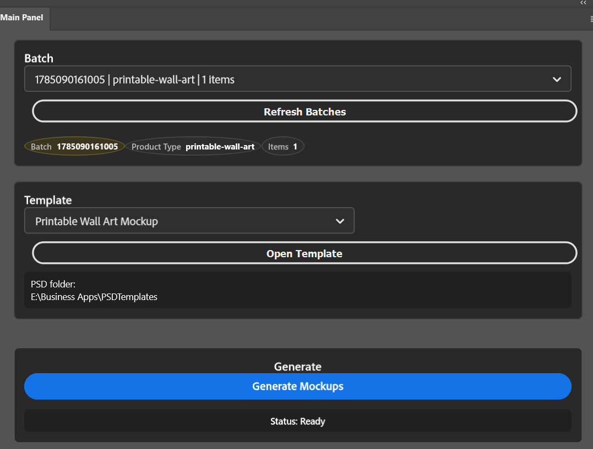
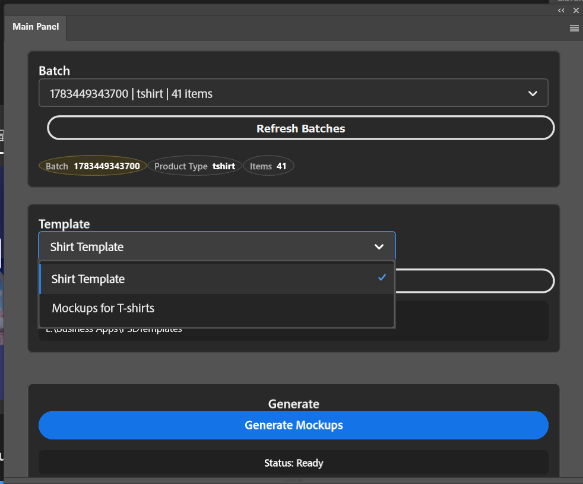
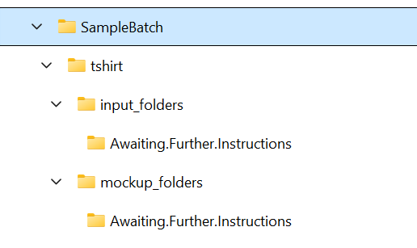
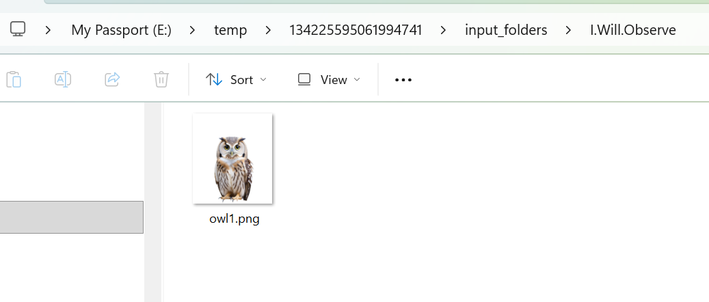
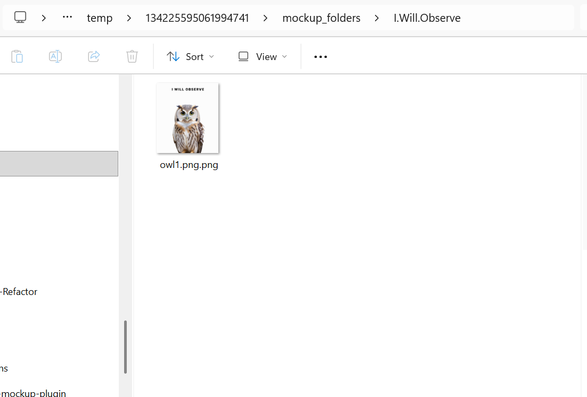
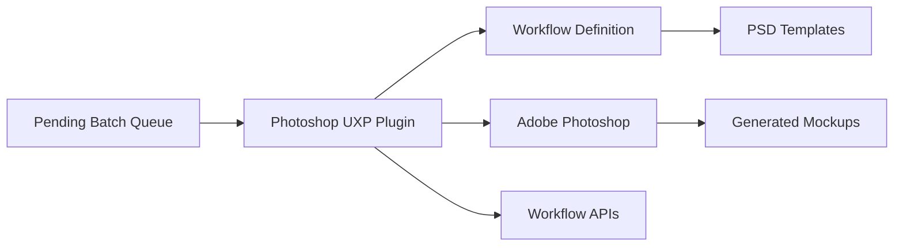

# Photoshop UXP Batch Mockup Plugin

A Photoshop UXP workflow execution engine for automated, batch-oriented mockup production.

The plugin coordinates Photoshop, configurable PSD workflow definitions, REST APIs, and structured production records to execute repeatable multi-step mockup pipelines.

It can operate independently with local JSON data or as the Photoshop execution component of the larger **Mockup Workflow Platform**.

**Version:** 0.2.0  
**Author:** Robert Walkama  
**License:** MIT  

---

## Why This Exists

Large-scale mockup production often requires repeatedly opening templates, replacing artwork, exporting files, organizing output folders, and reporting completion.

This plugin converts those manual Photoshop tasks into configurable workflow steps that can be executed against structured production batches.

Rather than hard-coding one mockup process, the plugin supports product-specific workflow processors and ordered PSD workflow definitions.

## Core Features

- Batch-oriented Photoshop automation
- Pending batch discovery through REST APIs
- Configurable, ordered PSD workflow steps
- Product-specific workflow processors
- Dynamic PSD template discovery and selection
- Smart object artwork and phrase replacement
- Group-based and whole-document PNG export
- Automatic upload of generated output files
- Per-item success and failure reporting
- Automatic continuation across workflow steps
- Local JSON and API/database data sources
- Persistent PSD and folder permissions through Adobe UXP

## Screenshots

### Plugin Panel


### PSD Template Selection


### Generated Batch Structure
Generated assets are organized into a predictable batch and product directory structure, allowing downstream workflow stages to process input and mockup files consistently.





## Demo
The demo below shows PSD selection, structured record processing, smart object replacement, and automated PNG export.

### Batch Workflow


---

## Architecture

The plugin executes configurable Photoshop workflow steps against production batches supplied by either local JSON files or external services.



---
## Execution Pipeline

For each production batch, the plugin executes an ordered workflow:

1. Discover pending batches or load local records.
2. Load the workflow definition for the selected product type.
3. Open the PSD template for the current workflow step.
4. Execute the corresponding workflow processor.
5. Replace artwork, text, or smart objects.
6. Export generated output images.
7. Upload generated assets to downstream services when configured.
8. Mark the workflow item as completed or failed.
9. Continue automatically to the next workflow step until the batch finishes.
---

## File System Integration

The plugin uses Adobe UXP persistent storage APIs to:

* remember selected folders
* persist PSD root locations
* maintain input/output directories between sessions

This avoids repeated folder selection and improves production workflow efficiency.

---

## Supported Data Sources

The plugin is designed to support both standalone and distributed production workflows.

### PSD Workflow Definitions

Workflow definitions can be loaded from:

- Local JSON files
- REST API endpoints
- Database-backed services

Each workflow definition specifies:

- product type
- ordered workflow steps
- PSD template
- execution order

### Production Records

Production records can be supplied from:

- Local JSON files
- Workflow API endpoints

Each record can include information such as:

- artwork or image reference
- phrase or text
- output folder
- filename
- batch identifier
- product type

This separation between workflow definitions and production data allows the same Photoshop workflows to process different products without modifying plugin code.

---

## Technical Architecture

### User Interface

- Adobe UXP
- Spectrum Web Components
- JavaScript

### Workflow Engine

- Ordered workflow execution
- Product-specific workflow processors
- Dynamic PSD template loading
- Sequential batch processing

### Integration

- REST API communication
- JSON data sources
- Persistent folder permissions
- Structured output generation

### Photoshop Automation

- Smart object replacement
- Layer manipulation
- PNG export
- PSD document management

---
## Design Highlights

The project demonstrates several software engineering concepts beyond Photoshop scripting:

- Data-driven workflow definitions
- Product-specific workflow dispatch
- Separation of UI, workflow engine, and service layer
- REST API integration
- Sequential workflow execution
- Configurable PSD processing pipelines
- Persistent Adobe UXP storage management
- Fault-tolerant batch processing
---

## Design Goal

The primary goal of the plugin is to reduce repetitive Photoshop production work by converting manual mockup generation into a scalable, repeatable automation pipeline.

The plugin supports structured PSD template loading, smart object replacement, JSON or DB-driven workflows, and organized PNG export generation for batch mockup production.

## Installation

1. Clone the repository.

```bash
git clone https://github.com/swisherman/photoshop-uxp-batch-mockup-plugin.git
```

2. Copy the example configuration.

```text
src/config.example.js
        ↓
src/config.js
```

3. Update the API endpoints in `config.js` for your environment.

4. Open Adobe UXP Developer Tool.

5. Add the `src/` folder as a plugin.

6. Load the plugin in Photoshop.

## Quick Start Demo

⚠️ The plugin will not load correctly until `src/config.js` exists.

### 1. Clone the repository

```bash
git clone https://github.com/swisherman/photoshop-uxp-batch-mockup-plugin.git
```

## Configuration

The plugin reads its runtime configuration from `src/config.js`.

A sample configuration is provided as:

```text
src/config.example.js
```

Copy it to:

```text
src/config.js
```

The src/config.js file is intentionally excluded from source control so that environment-specific settings and local service endpoints are never committed.

`API_BASE_URL` should point to your local Workflow API instance. Additional endpoint paths are configured within the plugin.

Example:

```javascript
const CONFIG = {
    API_BASE_URL: "http://localhost:5767",

    ENDPOINTS: {
        // Workflow API endpoints
    },

    HEADERS: {
        "Content-Type": "application/json"
    }
};

module.exports = CONFIG;
```

The `src/config.js` file is intentionally excluded from source control so that environment-specific settings and local service endpoints are never committed.
---
## Demo Data Notes

The demo JSON workflow expects image/input folders that match the
`ExpectedFolderName` or related folder-mapping fields contained in the JSON records.

Example:

```json
{
  "Phrase": "Coffee First",
  "ExpectedFolderName": "coffee-frog"
}
```

## Demo Folder Structure

```txt
examples/
 ┗ PSDFiles.json
templates/
 ┗ shirts/README.md
input_folders/
 ┗ [design assets]

mockup_folders/
 ┗ [exported PNGs]
``` 

## Technical Stack
- JavaScript (Adobe UXP)
- Photoshop BatchPlay API
- Local File System + Persistent Tokens
- JSON / DB Data Sources
- Smart Object Automation
- Structured Batch Export Pipelines

## Professional Use Case

Designed for scalable production workflows such as:

- Print-on-demand mockup generation
- Etsy / Shopify product automation
- Bulk phrase-based merchandise creation
- Internal creative production pipelines

## Known Limitations

- Requires Adobe Photoshop with UXP support.
- Demo workflows assume compatible PSD templates.
- API-driven workflows require the supporting workflow services to be running.
- Additional product-specific workflow processors are planned.

## Current Status

The project has evolved from a single-template Photoshop automation tool into a configurable workflow execution engine capable of processing production batches through ordered PSD workflow definitions.

Current capabilities include:

- Batch-oriented workflow execution
- Configurable multi-step PSD pipelines
- Product-specific workflow processors
- Local JSON and REST API data sources
- Dynamic PSD template selection
- Automatic batch progression and completion reporting
- Structured PNG export
- Persistent Adobe UXP folder permissions

Future work will focus on expanding workflow processors, improving extensibility, and refining the user experience.

## Project Structure


### Key Directories

| Directory | Purpose |
|-----------|---------|
| `src/` | Plugin source code, UI, and workflow engine |
| `src/services/` | REST API communication and data access |
| `assets/` | Screenshots and demo media |
| `examples/` | Sample workflow definitions and demo data |
| `templates/` | Example PSD template structure |


```txt
assets/
├── screenshots/


examples/
├── demo-data.json
└── PSDFiles.json

templates/
└── shirts/
    └── README.md

src/
├── icons/
├── services/
│   ├── datasource.js
│   ├── logService.js
│   └── psdTemplateService.js
├── config.example.js
├── index.html
├── main.js
├── manifest.json
└── style.css
```

## Future Improvements

Planned enhancements include:

- additional PSD validation
- improved export error handling
- batch progress UI
- enhanced DB workflow support
- configurable smart object mappings
- export preset management