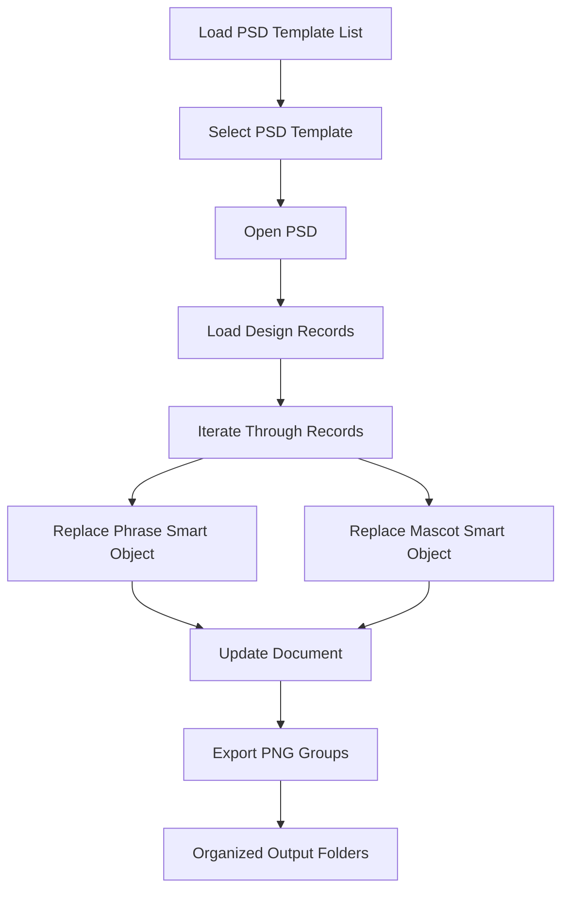

# Photoshop UXP Batch Mockup Plugin

Automates PSD template loading, phrase replacement, mascot swapping, and structured PNG export for scalable mockup production.

Supports both local JSON-driven workflows and remote API/database-driven workflows.

**Version:** 0.1.0  
**Author:** Robert Walkama  
**License:** MIT  

---

## Why This Exists
Built to eliminate repetitive Photoshop mockup production by combining PSD template management, structured design imports, smart object automation, and scalable export pipelines.

## Core Features
- PSD template loading from JSON or MongoDB
- Persistent PSD root folders by source
- Structured design import from JSON or DB
- Smart object mascot replacement
- Smart object phrase replacement
- Organized folder-based PNG export

---
## Screenshots

### Plugin Panel


### PSD Template Selection


### Structured Export Output


## Demo
The demo below shows PSD selection, structured record processing, smart object replacement, and automated PNG export.

### Batch Workflow


---

## Architecture / Workflow

## High-Level Workflow

The plugin automates batch Photoshop mockup generation using structured JSON or DB-driven input.

### Processing Flow



---

## Core Workflow

### 1. PSD Template Selection

The plugin loads PSD template metadata from either:

* JSON file
* DB/API endpoint

Templates are displayed in the UI and opened dynamically through Adobe UXP APIs.

---

### 2. Structured Design Import

The plugin imports structured records containing:

* phrase text
* mascot/image references
* folder names
* output metadata

Example fields:

```json
{
  "Phrase": "I Am Evaluating",
  "FolderName": "I.Am.Evaluating",
  "Mascot": "raccoon",
  "Filename": "eval.png"
}
```

This separates:

* workflow data
* document automation logic

making large-scale processing possible.

---

### 3. Smart Object Replacement

For each imported record, the plugin:

* updates text smart objects
* replaces mascot/image smart objects
* refreshes document content dynamically

This enables scalable mockup generation without manually editing PSDs.

---

### 4. Group-Based Export Pipeline

The plugin traverses Photoshop layer groups and exports compositions as PNG files.

Typical workflow:

```txt
Completed/
├── I.Am.Evaluating/
│   ├── mockup-1.png
│   ├── mockup-2.png
│   └── mockup-3.png
```

Exports are organized into structured output folders for downstream workflows such as:

* Etsy
* Shopify
* Print-on-demand pipelines
* batch listing generation

---

## File System Integration

The plugin uses Adobe UXP persistent storage APIs to:

* remember selected folders
* persist PSD root locations
* maintain input/output directories between sessions

This avoids repeated folder selection and improves production workflow efficiency.

---

## Supported Data Sources

### PSD Templates

* JSON file
* DB/API endpoint

### Design Records

* JSON file
* DB/API endpoint

This allows the plugin to operate in:

* local/offline workflows
* database-driven production environments

---

## Technical Components

### Frontend

* JavaScript
* Adobe UXP APIs
* Spectrum Web Components

### Workflow Features

* asynchronous batch processing
* persistent storage tokens
* structured export handling
* folder-based automation
* data-driven document updates

---

## Design Goal

The primary goal of the plugin is to reduce repetitive Photoshop production work by converting manual mockup generation into a scalable, repeatable automation pipeline.

The plugin supports structured PSD template loading, smart object replacement, JSON or DB-driven workflows, and organized PNG export generation for batch mockup production.

## Install / Load in Photoshop

1. Copy `src/config.example.js` to `src/config.js`
2. Open Adobe UXP Developer Tool
3. Add the `src/` folder as the plugin
4. Load the plugin in Photoshop

## Quick Start Demo

⚠️ The plugin will not load correctly until `src/config.js` exists.

### 1. Clone the repository

```bash
git clone https://github.com/swisherman/photoshop-uxp-batch-mockup-plugin.git
```

## Configuration

The real `config.js` file is excluded via `.gitignore` to avoid committing local endpoints or environment-specific settings.

This project uses a local configuration file that is intentionally excluded from source control.

Copy:

```txt
src/config.example.js
```

to:

```txt
src/config.js
```

Example configuration:

```javascript
const CONFIG = {
    API_BASE_URL: "http://localhost:8054",
    ENDPOINTS: {
        RECORDS_READY: "/records/ready",
        PSDS: "/psds",
        LOG: "/logs"
    },
	HEADERS: {
    "Content-Type": "application/json"
}
};

module.exports = CONFIG;
```


### JSON-Based Demo Workflow
1. Select PSD Template → JSON File
2. Load examples/PSDFiles.json
3. Select PSD Root Folder → templates
4. Open selected PSD
5. Select Import Designs JSON
6. Choose input/output folders
7. Run Phrase Import

---
## Demo Data Notes

The demo JSON workflow expects image/input folders that match the
`ExpectedFolderName` or related folder-mapping fields contained in the JSON records.

Example:

```json
{
  "Phrase": "Coffee First",
  "ExpectedFolderName": "coffee-frog"
}
```

## Demo Folder Structure

```txt
examples/
 ┗ PSDFiles.json
templates/
 ┗ shirts/README.md
input_folders/
 ┗ [design assets]

mockup_folders/
 ┗ [exported PNGs]
``` 

## Technical Stack
- JavaScript (Adobe UXP)
- Photoshop BatchPlay API
- Local File System + Persistent Tokens
- JSON / DB Data Sources
- Smart Object Automation
- Structured Batch Export Pipelines

## Professional Use Case

Designed for scalable production workflows such as:

- Print-on-demand mockup generation
- Etsy / Shopify product automation
- Bulk phrase-based merchandise creation
- Internal creative production pipelines

## Known Limitations
- PSD template structure currently expects named smart object layers:
  - mascot
  - phrase
- Input folder assets must align with expected folder/file naming
- DB / endpoint mode depends on external service availability
- UI polish and additional validation are still in progress


## Current Status
Version 0.1.0 is an active proof-of-work release demonstrating:

- JSON + DB workflow support
- Batch PSD automation
- Smart object phrase + mascot replacement
- Structured export logic

Planned improvements:

- Enhanced validation
- UI refinement
- Config abstraction
- Expanded documentation

## Project Structure

```txt
assets/
├── screenshots/


examples/
├── demo-data.json
└── PSDFiles.json

templates/
└── shirts/
    └── README.md

src/
├── icons/
├── services/
│   ├── datasource.js
│   ├── logService.js
│   └── psdTemplateService.js
├── config.example.js
├── index.html
├── main.js
├── manifest.json
└── style.css
```

## Future Improvements

Planned enhancements include:

- additional PSD validation
- improved export error handling
- batch progress UI
- enhanced DB workflow support
- configurable smart object mappings
- export preset management